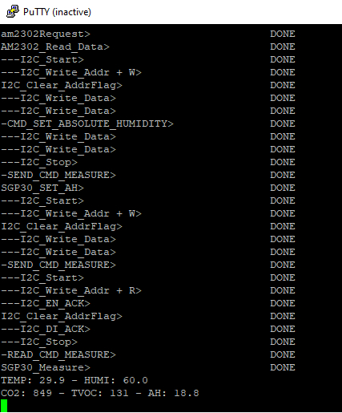

# stm32_programing
STM32L152RE bare metal

### Material:
1. [SGP30](https://files.seeedstudio.com/wiki/Grove-VOC_and_eCO2_Gas_Sensor-SGP30/img/pin.jpg)

2. [AM2302](https://www.industrialshields.com/web/image/178608/dht22-temperature-sensor.png)

### Result:

