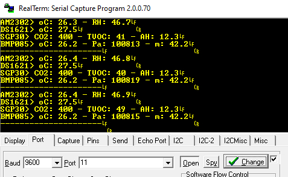
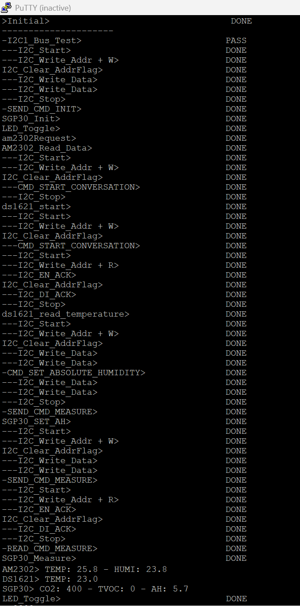

# stm32_programing
STM32L152RE bare metal with IDE STM32_TrueStudio

### Material:
1. am2302 - 1-wire
2. ds1621 - I2C
3. sgp30 - I2C
4. lcd1602 - I2C
5. bmp085 - I2C

### Circuit

### Result:

### Debug log:

PS: My project is still working... 